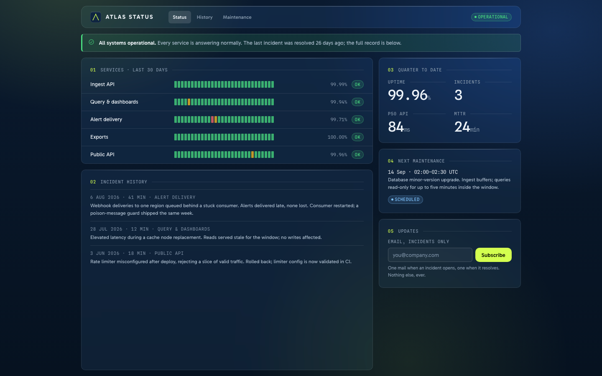

# ATLAS

A dense, glass-based design system in two themes. Rounded glass over navy light blooms,
one chartreuse for every action, 10px tracked labels against 46px tabular figures.


- **[Brand book (PDF)](docs/atlas-brand-book.pdf)** — the design language as one printable document
- **[Showcase](showcase.html)** · [components](components.html) · [foundations](foundations.html)
- **[The language](docs/LANGUAGE.md)** · [behavior contract](docs/BEHAVIOR.md) · [accessibility notes](docs/NOTES.md) · [repository overview](docs/OVERVIEW.md)
- **[Figma library](https://www.figma.com/design/ayWVXqf7MA50EShkOda7IF)** — the language as a Figma file: true Dark/Light variable modes, mode-aware components, in-file documentation, the one-sheet, three UI proposals and the applications board

## Use it

```html
<link href="https://fonts.googleapis.com/css2?family=Gabarito:wght@400;500;600;700&family=Spline+Sans+Mono:wght@400;500&display=swap" rel="stylesheet" />
<link rel="stylesheet" href="https://unpkg.com/@phosphor-icons/web@2.1.1/src/regular/style.css" />
<link rel="stylesheet" href="styles.css" />
<link rel="stylesheet" href="components.css" />
```

Set `data-theme="dark"` or `"light"` on `<html>`, then build from the semantic layer only:

```html
<div class="a-glass" style="padding:21px">
  <div class="a-idx"><b>01</b> REVENUE · MARCH</div>
  <div class="a-kpi"><span class="v a-num">48,210<small>EUR</small></span></div>
  <button class="a-btn a-btn--primary">Close month</button>
</div>
```

The same markup flips themes untouched. `tools/check_contrast.py` proves every colour
role in both themes on every run.

## In use

Three case screens, composed only from `components.css` — an ops console, a month close,
and a public status page:



