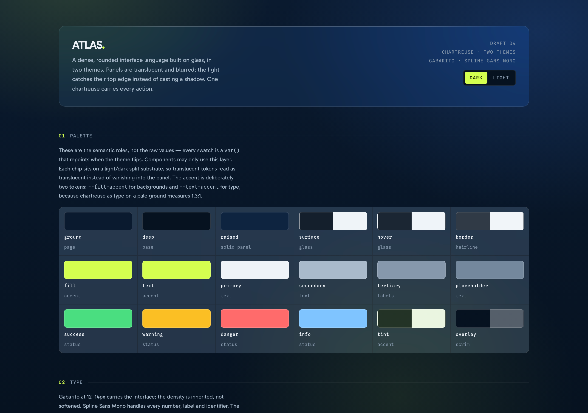
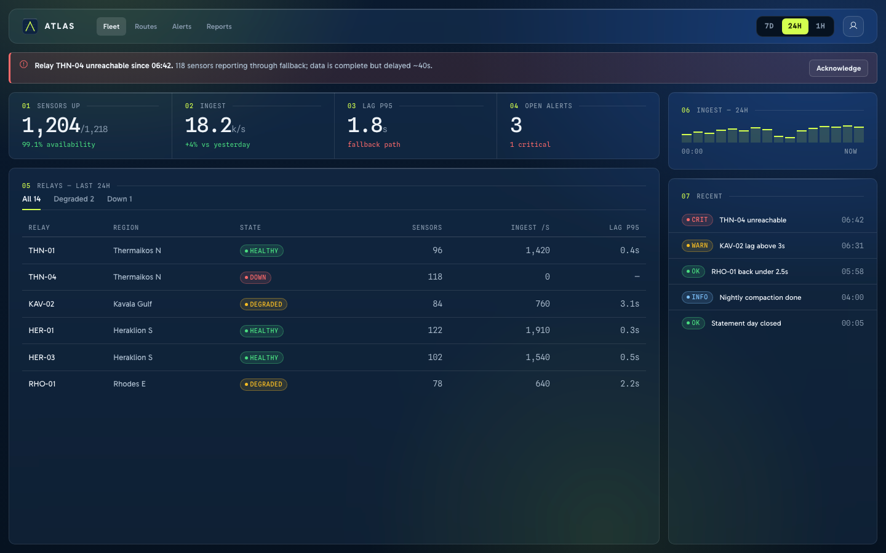

# ATLAS

A dense, glass-based design system in two themes. Rounded glass over navy light blooms,
one chartreuse for every action, 10px tracked labels against 46px tabular figures.



**[Brand book (PDF)](docs/atlas-brand-book.pdf)** · [showcase](showcase.html) · [language](docs/LANGUAGE.md) · [behavior](docs/BEHAVIOR.md) · [notes](docs/NOTES.md) · [overview](docs/OVERVIEW.md) · [Figma library](https://www.figma.com/design/ayWVXqf7MA50EShkOda7IF)

```html
<link rel="stylesheet" href="styles.css" />
<link rel="stylesheet" href="components.css" />

<div class="a-glass" style="padding:21px">
  <div class="a-idx"><b>01</b> REVENUE · MARCH</div>
  <button class="a-btn a-btn--primary">Close month</button>
</div>
```

Set `data-theme="dark"` or `"light"` on `<html>`; the same markup flips themes untouched.



Three case screens in `cases/`, composed from `components.css` alone. The rest of the
detail lives in [docs/OVERVIEW.md](docs/OVERVIEW.md).
