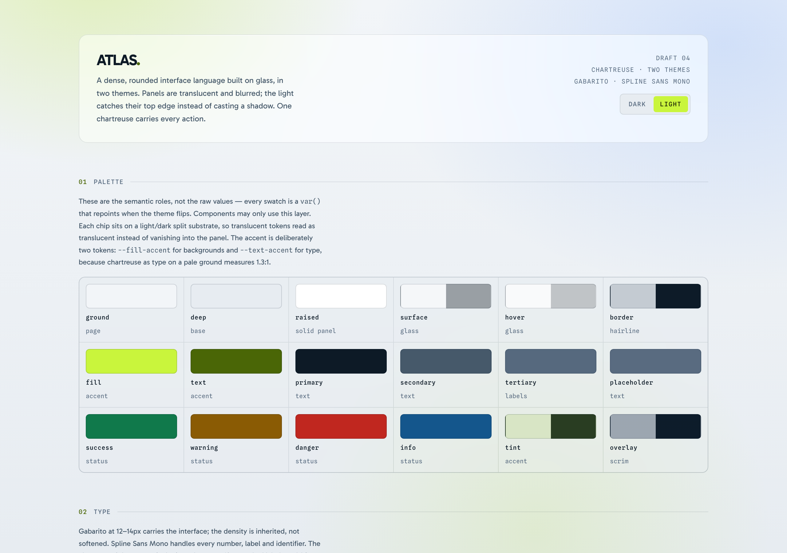
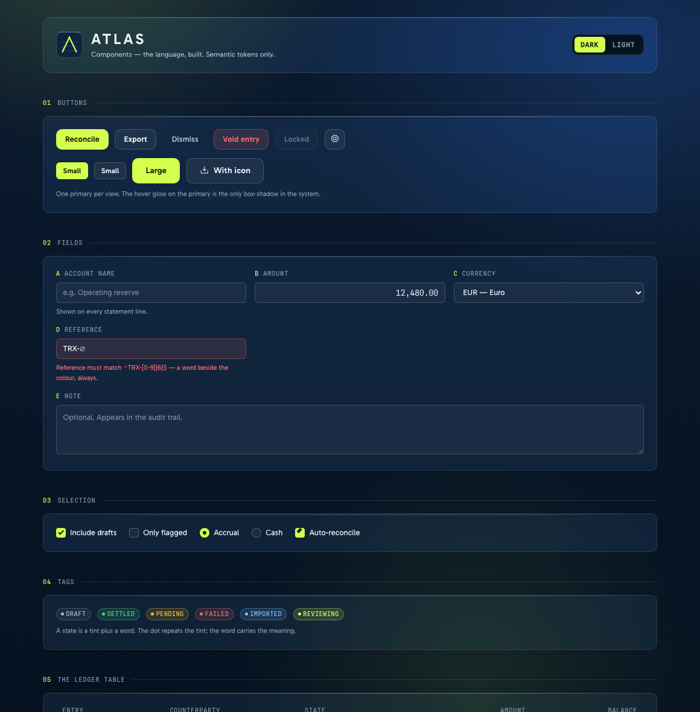
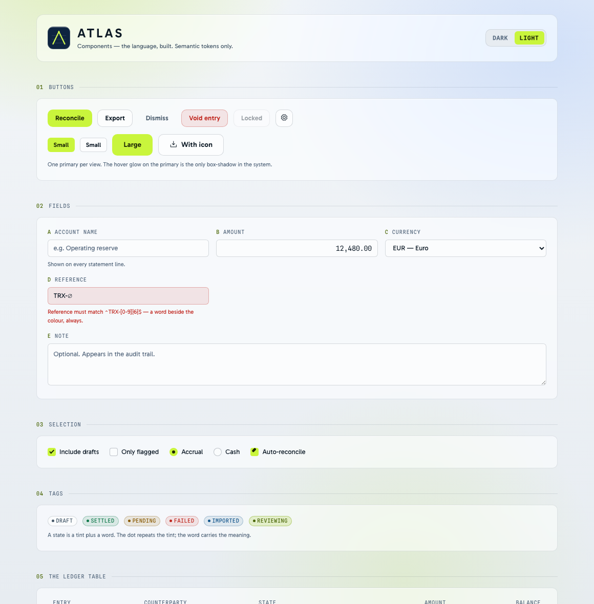
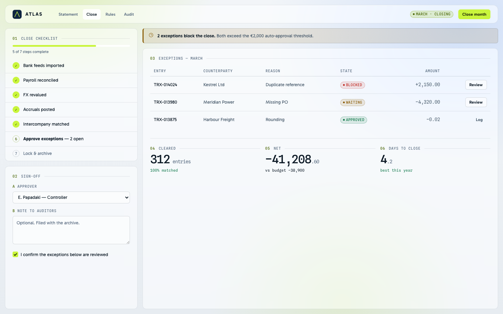
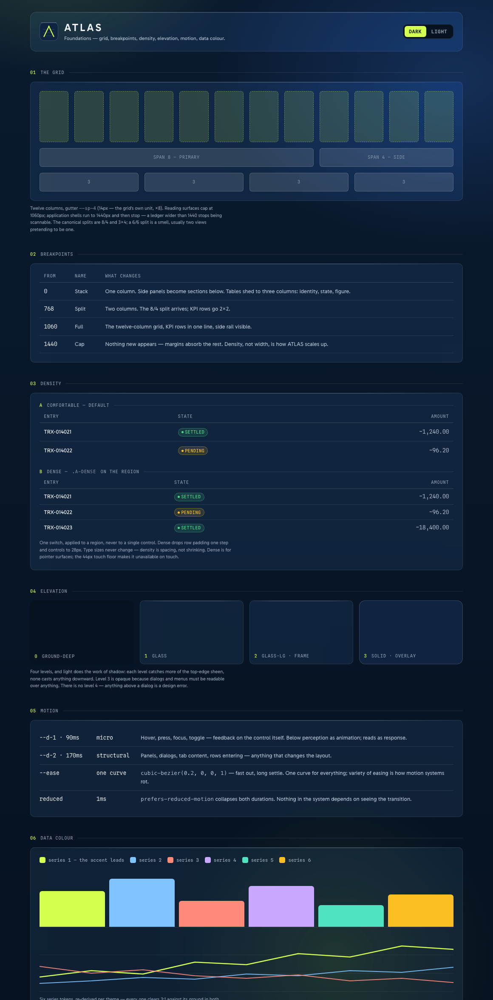

# ATLAS
A dense, glass-based design system in two themes — language, tokens, components, and the cases that prove it.

**[Open the showcase →](showcase.html)** — the language applied across palette, type, readout, glass depth, controls, ledger, attention, iconography, geometry and motion, with a theme toggle. **[components.html](components.html)** is the component layer built on it. `showcase-standalone.html` is the showcase with fonts and icons inlined; it opens offline.




**Rounded glass, two themes.** Dark is navy (#0A1A2F over #061220) with soft chartreuse and blue light blooms behind it, so the blur has something real to refract. Light runs the same device at lower amplitude. One chartreuse (#D4FF4F) carries every action, link and active state. Type is **Gabarito** for the interface and **Spline Sans Mono** for anything numeric; the system's character is the jump between 10px tracked labels and 46px tabular figures with very little in between.

### Identity


The mark is the system drawn small: a raised-navy tile at the frame radius, three contour hairlines, and one chartreuse peak whose crossbar is the contour it crosses. `assets/mark.svg` is self-coloured and works on any ground; `assets/mark-mono.svg` is currentColor, inline-only. Lockup: mark plus ATLAS in Gabarito 700 tracked 0.14em; the mark never appears without the name except as a favicon.

### Components

Built from the semantic tokens only — any hex in `components.css` is a bug. Buttons, fields, selection, tags, the ledger table, tabs, segmented, dialog, flags, readouts and empty states. The same markup flips themes untouched.




### In use

Two case screens from deliberately different products, both composed only from `components.css` — the language is not product-specific. Four empty-state illustrations (`assets/illustrations/`) — hairline slate, one chartreuse accent each — cover no-entries, no-results, feed-interrupted and first-run.




### Foundations

Grid, breakpoints, density, elevation, motion and data colour, specified in
**[foundations.html](foundations.html)**. Six data-series tokens re-derived per theme — every one
clears 3:1 against its ground; order fixed, colour never the only carrier. Density is one switch
(`.a-dense`) on a region, and it changes spacing, never type.



### Skinning another product

The system is not tied to a product. To reskin: change the accent trio (`--lime-400/300/500`), the
ground pair (`--navy-900/950` dark, `--pale-100/200` light) and re-derive `--text-accent` for the new
accent against both grounds. The semantic layer and every component follow untouched — the two case
screens were built exactly this way, from `components.css` alone.

**`tokens.json`** carries every token machine-readably (colors, dimensions, durations, aliases as
references), generated from `tokens.css` by `tools/build_tokens.py` — edit the CSS, regenerate, never
edit the JSON.

### Using it

```html
<link href="https://fonts.googleapis.com/css2?family=Gabarito:wght@400;500;600;700&family=Spline+Sans+Mono:wght@400;500&display=swap" rel="stylesheet" />
<link rel="stylesheet" href="https://unpkg.com/@phosphor-icons/web@2.1.1/src/regular/style.css" />
<link rel="stylesheet" href="styles.css" />
<link rel="stylesheet" href="components.css" />
```

Set `data-theme="dark"` or `"light"` on `<html>`. `styles.css` pulls in `tokens.css` then `base.css`; add `components.css` for the component layer.

Five rules worth keeping in front of you:

- Use the **semantic** layer only — `--surface`, `--border`, `--text-primary`, `--fill-accent`. Never a primitive.
- `--fill-accent` for backgrounds, `--text-accent` for type. They are not interchangeable.
- Never nest a blurred panel inside another blurred panel.
- One signal per view: one flagged item, one primary button.
- Icons never carry meaning alone and never appear without an accessible name.

### Files

| File | What |
| --- | --- |
| `styles.css` | Entry point. Imports the two token files. |
| `tokens.css` | Colour, type, spacing, geometry, motion. |
| `base.css` | Resets, type defaults, and the `.a-idx` / `.a-glass` / `.a-num` utilities. |
| `components.css` | The component layer. Semantic tokens only. |
| `components.html` | The component specimen, with the theme toggle. |
| `showcase.html` | The language applied, with the theme toggle. |
| `showcase-standalone.html` | The showcase as one self-contained file. Compiled output; edit `showcase.html`, never this. |
| `foundations.html` | Grid, breakpoints, density, elevation, motion, data colour. |
| `tokens.json` | Machine-readable tokens, generated by `tools/build_tokens.py`. |
| `assets/` | The mark and the four empty-state illustrations. |
| `cases/` | The two case screens; captures in `docs/`. |

### More

- [The language, token structure, themes and iconography](docs/LANGUAGE.md)
- [Accessibility, glass caveats and what is still open](docs/NOTES.md)
